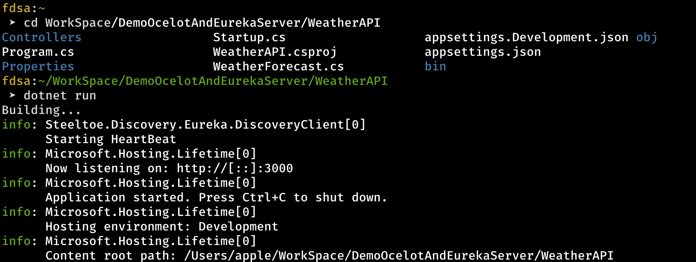

# DemoOcelotAndEurekaServer
Ocelot Discovery Service using Ocelot Eureka Client and Steeltoe Client


### --- Configuration ---

1. Weather API 
    - Running at http://localhost:3000
    - API Endpoint: http://localhost:3000/weatherforecast
    

    - Eureka Config (see @WeatherAPI/appsettings.json)
        + Instance Weather API: weather-service
        + Host and Port: locahost:3000
        + Eureka Server: localhost:8761

2. Gateway API
    - Running at http://localhost:5000 
    - Ocelot Config:
        + Route: http://localhost:5000/api/weather ==> forward to Weather API at http://localhost:3000/weatherforecast
        + Disconvery Service using Ocelot Eureka
    - Eureka Config (see @GatewayAPI/appsettings.json)
        + Instance Weather API: gw-service
        + Host and Port: locahost:5000
        + Eureka Server: localhost:8761

3. Eureka Server
    - Running at http://localhost:8761

### --- How to run ---
Requirements:
- Dotnet core 5.0.1
- Java 15

1. Start Eureka Server
    ```
    cd EurekaServer
    java -jar discovery-service-app-1.0.0-SNAPSHOT.jar
    ```
    
2. Start Weather API
    ```
    cd WeatherAPI
    dotnet run
    ```
    
3. Start Gateway API
    ```
    cd GatewayAPI
    dotnet run
    ```
    
4. Check Eureka Server
    - Go to http://localhost:8761
    - Check weather-service and gw-service are registered.
    

